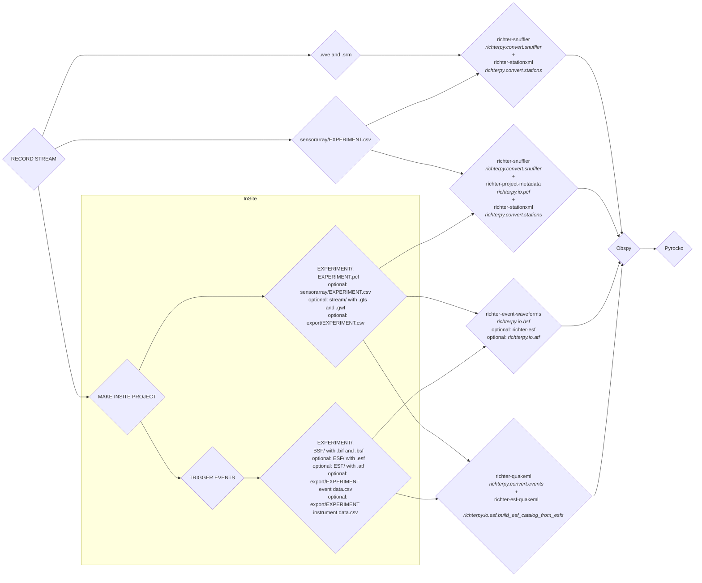

```mermaid
  graph LR;
      A-->A1 & A2;
      A-->B
      subgraph InSite
      B-->B1;
      B-->C
      C-->C1;
      end
      A1 & A2 --> O1
      A2 & B1 --> O2
      B1 & C1 --> O3
      B1 & C1 --> O4
      O1 & O2 & O3 & O4 --> O;
      O-->P;

A{
    RECORD STREAM
}
A1{
    .wve and .srm
}
A2{    
    sensorarray/EXPERIMENT.csv
}
B{
    MAKE INSITE PROJECT
}
B1{
    EXPERIMENT/:
    EXPERIMENT.pcf
    optional: sensorarray/EXPERIMENT.csv
    optional: stream/ with .gts and .gwf
    optional: export/EXPERIMENT.csv
}
C{
    TRIGGER EVENTS
}
C1{
    EXPERIMENT/:
    BSF/ with .bif and .bsf
    optional: ESF/ with .esf
    optional: ESF/ with .atf
    optional: export/EXPERIMENT event data.csv
    optional: export/EXPERIMENT instrument data.csv
}
O1{
    richter-snuffler
    <i>richterpy.convert.snuffler</i>
    +
    richter-stationxml
    <i>richterpy.convert.stations</i>
}
O2{
    richter-snuffler
    <i>richterpy.convert.snuffler</i>
    +
    richter-project-metadata
    <i>richterpy.io.pcf</i>
    +
    richter-stationxml
    <i>richterpy.convert.stations</i>
}
O3{
    richter-event-waveforms
    <i>richterpy.io.bsf</i>
    optional: richter-esf
    optional: <i>richterpy.io.atf</i>

}
O4{
    richter-quakeml
    <i>richterpy.convert.events</i>
    +
    richter-esf-quakeml
    <i>richterpy.io.esf.build_esf_catalog_from_esfs</i>
}
O{
    Obspy
}
P{
    Pyrocko
}
```

Note: command-line scripts/entry points are shown in plain text; Python modules and APIs are shown in italics.
