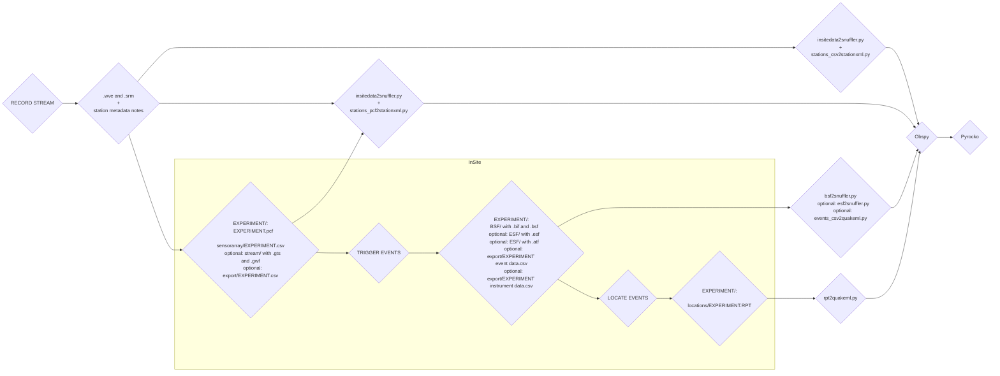

```mermaid
  graph LR;
      A-->B;
      B-->C;
      subgraph InSite
      C-->D;
      D-->E;
      E-->F;
      F-->G;
      end
      B-->O1;
      B-->O2;
      C-->O2;
      E-->O3;
      G-->O4;
      O1 & O2 & O3 & O4 --> O;
      O-->P;

A{
    RECORD STREAM
}
B{
    .wve and .srm
    +
    station metadata notes
}
C{
    EXPERIMENT/:
    EXPERIMENT.pcf
    sensorarray/EXPERIMENT.csv
    optional: stream/ with .gts and .gwf
    optional: export/EXPERIMENT.csv
}
D{
    TRIGGER EVENTS
}
E{
    EXPERIMENT/:
    BSF/ with .bif and .bsf
    optional: ESF/ with .esf
    optional: ESF/ with .atf
    optional: export/EXPERIMENT event data.csv
    optional: export/EXPERIMENT instrument data.csv
}
F{
    LOCATE EVENTS
}
G{
    EXPERIMENT/:
    locations/EXPERIMENT.RPT
}
O1{
    insitedata2snuffler.py
    +
    stations_csv2stationxml.py
}
O2{
    insitedata2snuffler.py
    +
    stations_pcf2stationxml.py
}
O3{
    bsf2snuffler.py
    optional: esf2snuffler.py
    optional: events_csv2quakeml.py

}
O4{
    rpt2quakeml.py
}
O{
    Obspy
}
P{
    Pyrocko
}
```